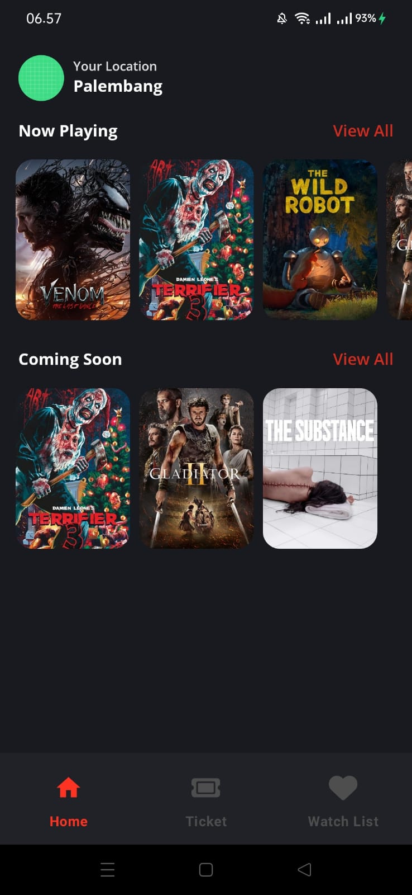
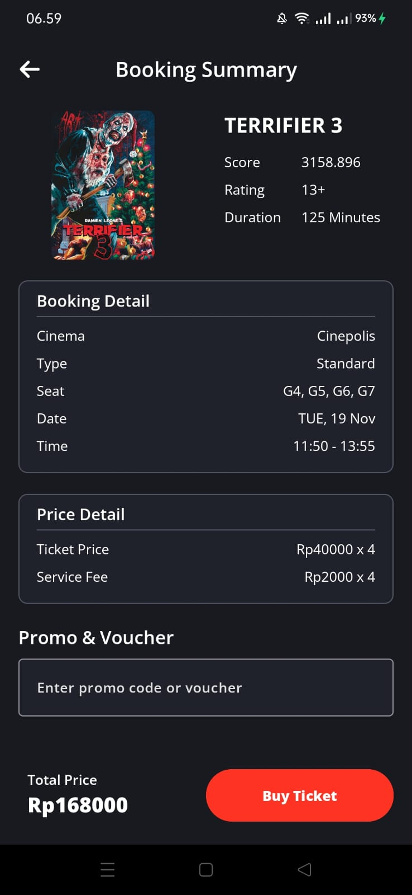
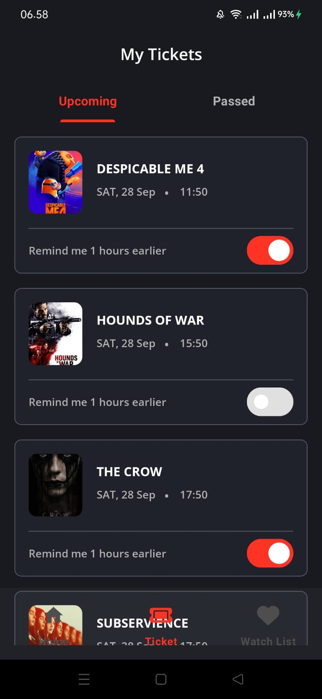
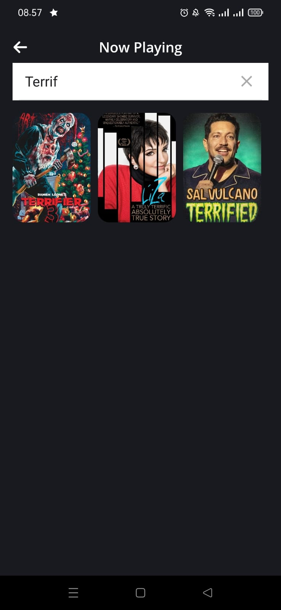

[![Contributors][contributors-shield]][contributors-url]
[![LinkedIn][linkedin-shield]][linkedin-url]

<!-- PROJECT LOGO -->
 

  

  <h3 align="center">Movifar</h3>

  

    Movie Booking Ticket App
     
  

<!-- TABLE OF CONTENTS -->
<!-- 

  
Table of Contents

  <ol>
    <li>
      <a href="#about-the-project">About The Project</a>
      <ul>
        <li><a href="#built-with">Built With</a></li>
      </ul>
    </li>
    <li><a href="#contributing">Contributing</a></li>
    <li><a href="#contact">Contact</a></li>
  </ol>

 -->

<!-- ABOUT THE PROJECT -->
## About The Project

Movifar is a mobile application that simplifies movie ticket bookings. Users can browse "Now Playing" and "Coming Soon" movies, select seats, choose the date and time, 
and receive tickets complete with barcodes for easy check-ins. Notifications ensure users are reminded an hour before their movie starts.

**Key Features:**

- Browse Movies: Explore movies that are currently playing or upcoming.
- Seat Selection: Choose your preferred seats from the interactive layout.
- Secure Booking: Integrated fingerprint authentication for added security.
- Dynamic Features: Modular app components using Android Dynamic Feature modules.
- Reminders: Get notified 1 hour before the movie begins.
- Secure Transactions: Features like SSL pinning for secure API communication and obfuscation to protect code integrity.

**Screenshots App:**

  
| Home Screen | Detail Movie Screen | Booking Seats Screen |
|:--------------:|:------------:|:---------------:|
|  |  |  |

| Summary Screen | Tickets Screen | Detail Ticket Screen |
|:-----------:|:----------------:|:-------------:|
|  |  |  |

| Search Screen | Watch List Screen |
|:-----------:|:----------------:|
|  |  |

### Built With

**Framework:**
* [![Android][Android]][Android-url]
* [![Kotlin][Kotlin]][Kotlin-url]

**Library and Technology:**
* [![Retrofit][Retrofit]][Retrofit-url]
* [![Dagger-Hilt][Dagger-Hilt]][Dagger-Hilt-url]
* [![Android-Jetpack][Android-Jetpack]][Android-Jetpack-url]
* [![Clean-Architecture][Clean-Architecture]][Clean-Architecture-url]

**Security Feature:**
* [![SSL-Pinning][SSL-Pinning]][SSL-Pinning-url]
* [![Proguard][Proguard]][Proguard-url]
* [![Biometric][Biometric]][Biometric-url]

<!-- CONRTIBUTORS -->
### Contributors:

<!-- 
(<a href="#readme-top">back to top</a>)
 -->

<!-- CONTACT -->
## Contact

Ja'far - ajib.aiwa@gmail.com

<!-- MARKDOWN LINKS & IMAGES -->
<!-- https://www.markdownguide.org/basic-syntax/#reference-style-links -->
[contributors-shield]: https://img.shields.io/github/contributors/jafar144/AshStory.svg?style=for-the-badge
[contributors-url]: https://github.com/othneildrew/Best-README-Template/graphs/contributors
[linkedin-shield]: https://img.shields.io/badge/-LinkedIn-black.svg?style=for-the-badge&logo=linkedin&colorB=555
[linkedin-url]: https://www.linkedin.com/in/jafarrmu/

[Android]: https://img.shields.io/badge/Android-34A853?style=for-the-badge&logo=android&logoColor=FFFFFF
[Android-url]: https://developer.android.com/develop
[Kotlin]: https://img.shields.io/badge/Kotlin-7F52FF?style=for-the-badge&logo=kotlin&logoColor=FFFFFF
[Kotlin-url]: https://kotlinlang.org/

[Retrofit]: https://img.shields.io/badge/Retrofit-20232A?style=for-the-badge&logo=retrofit&logoColor=61DAFB
[Retrofit-url]: https://pub.dev/packages/blochttps://square.github.io/retrofit/
[Dagger-Hilt]: https://img.shields.io/badge/Dagger--Hilt-20232A?style=for-the-badge&logo=bloc&logoColor=61DAFB
[Dagger-Hilt-url]: https://dagger.dev/hilt/
[Android-Jetpack]: https://img.shields.io/badge/Android--Jetpack-20232A?style=for-the-badge&logo=jetpack&logoColor=61DAFB
[Android-Jetpack-url]: https://developer.android.com/jetpack
[Clean-Architecture]: https://img.shields.io/badge/Clean--Architecture-20232A?style=for-the-badge&logo=clean&logoColor=61DAFB
[Clean-Architecture-url]: https://developer.android.com/topic/architecture

[SSL-Pinning]: https://img.shields.io/badge/SSL--Pinning-20232A?style=for-the-badge&logo=key&logoColor=61DAFB
[SSL-Pinning-url]: https://developer.android.com/privacy-and-security/security-ssl
[Proguard]: https://img.shields.io/badge/Proguard-20232A?style=for-the-badge&logo=proguard&logoColor=61DAFB
[Proguard-url]: https://developer.android.com/build/shrink-code?hl=id
[Biometric]: https://img.shields.io/badge/Biometric-20232A?style=for-the-badge&logo=biometric&logoColor=61DAFB
[Biometric-url]: https://developer.android.com/identity/sign-in/biometric-auth?hl=id
